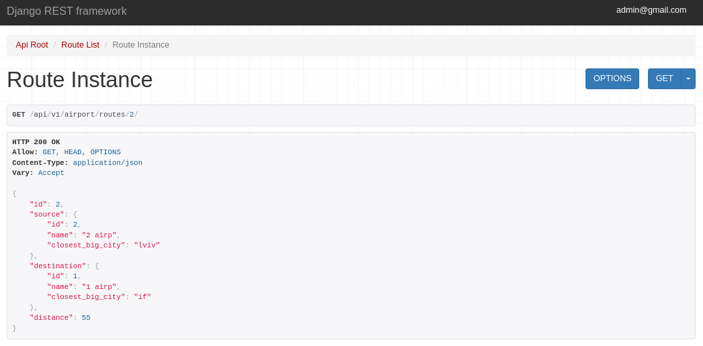

# Airport API Service

The Airport API service provides information about and manages airports, flights, and aircraft.

## Table of Contents

- [Installation](#installation)
- [Run with docker](#run-with-docker)
- [Getting access](#getting-access)
- [Technologies Used](#technologies-used)
- [Features](#features)
- [DB Structure](#db-structure)
- [An example of using the API](#an-example-of-using-the-api)

## Installation

Install PostgreSQL and create db

```bash
git clone https://github.com/AlexTsikhun/airport-api-service
cd airport-api-service
python3 -m venv .venv
source .venv/bin/activate
pip install -r requirements.txt
# for postgres set env variables
python3 manage.py makemigations
python3 manage.py migate
python3 manage.py runserver

```

## Run with docker
Docker should be installed locally

```bash
docker compose build
docker compose up
```

## Getting access

- Create user via `api/v1/user/register/`
- Get access token `api/v1/user/token/`
- API Root `api/v1/airport/`

## Technologies Used

- Django, DRF
- PostgreSQL (for production), Sqlite3 (for test)
- Docker, docker compose
- Unittest

## Features:
- JWT authenticated
- Admin panel `/admin/`
- Documentation is located at `api/schema/swagger-ui/` or `api/schema/redoc/`
- Managing flights and airplanes
- Creating orders, crew and airplane type
- Adding airport
- Filtering flights
- Throttling, Pagination for Order, Adding airplane image 
- Validation for Flight (A typical row on an airplane can consist of anywhere from 3 to 12 seats.
20-40 rows. Flight time can't be less than world`s shortest international flight route with
passengers - 10-15 minutes (19km, between the Caribbean islands of Sint Maarten and Anguilla)
and can't exceed 1 day)


#### DB Structure:


### An example of using the API

A list of some of the main endpoints

Created order:


Constraint order:


Paginated orders:


Flights:


Flight details:


Route details:



Airplane list:


Airplane details:


Airport list:


Crew:


